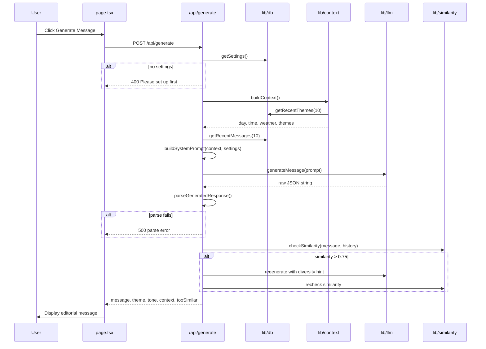
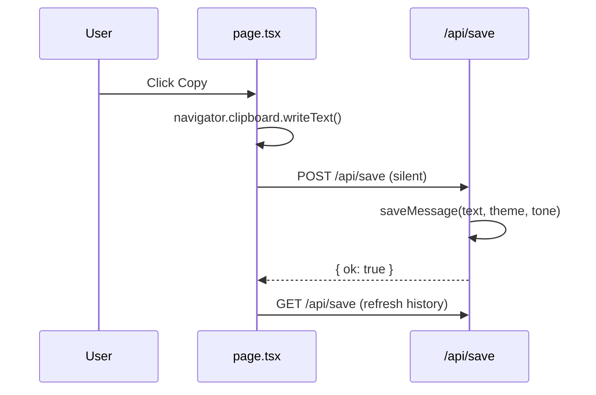
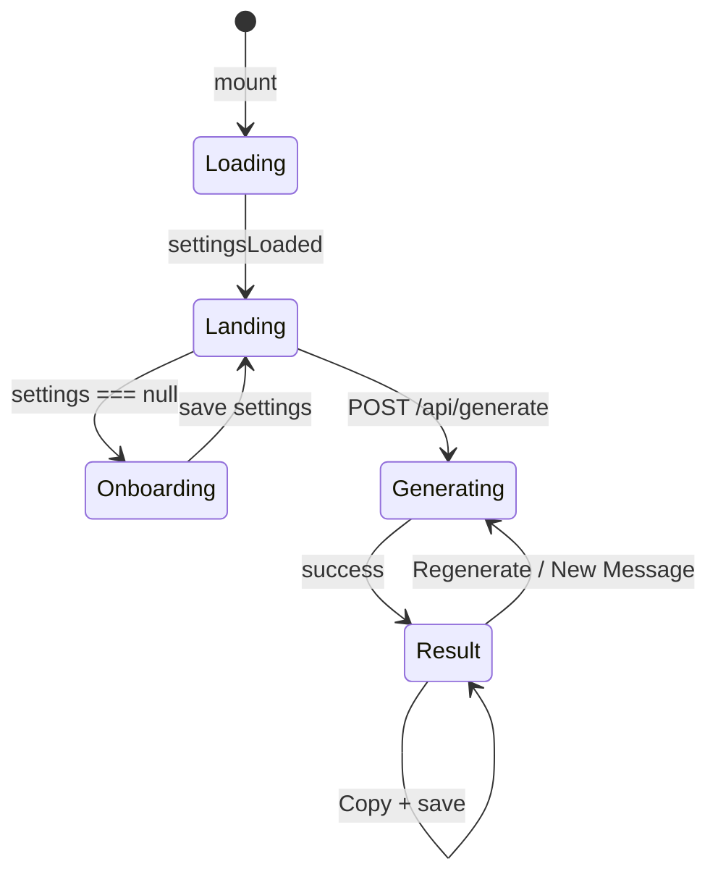
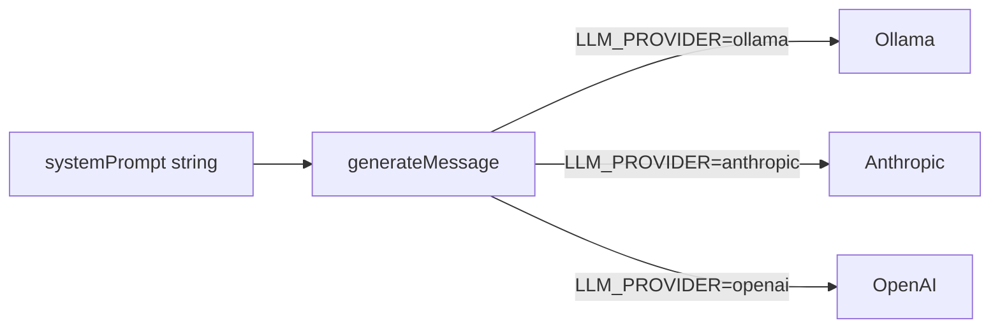

# Companion — Architecture

This document explains how every part of Companion fits together: the request lifecycle, each library module, the UI states, and the design decisions behind them.

---

## Table of contents

1. [System overview](#system-overview)
2. [Request lifecycle](#request-lifecycle)
3. [Layer map](#layer-map)
4. [Library modules (`lib/`)](#library-modules-lib)
5. [API routes (`app/api/`)](#api-routes-appapi)
6. [Frontend (`app/page.tsx`)](#frontend-apppagetsx)
7. [LLM provider layer](#llm-provider-layer)
8. [Prompt construction](#prompt-construction)
9. [Similarity engine](#similarity-engine)
10. [Persistence](#persistence)
11. [External services](#external-services)
12. [Configuration](#configuration)
13. [Design system](#design-system)
14. [Constraints and non-goals](#constraints-and-non-goals)

---

## System overview

Companion is a **single-page Next.js application** with three API routes and four server-side library modules. The browser never calls Ollama, Anthropic, or OpenAI directly — all AI traffic flows through `lib/llm.ts`.

```mermaid
flowchart TB
    subgraph client [Browser]
        UI[app/page.tsx]
    end

    subgraph nextjs [Next.js Server]
        GEN[/api/generate]
        SAVE[/api/save]
        SET[/api/settings]

        CTX[lib/context.ts]
        DB[lib/db.ts]
        SIM[lib/similarity.ts]
        LLM[lib/llm.ts]
    end

    subgraph external [External]
        OLLAMA[Ollama localhost:11434]
        METEO[Open-Meteo API]
        ANTH[Anthropic API]
        OAI[OpenAI API]
        SQLITE[(companion.db)]
    end

    UI -->|POST| GEN
    UI -->|GET/POST| SAVE
    UI -->|GET/POST| SET

    GEN --> CTX
    GEN --> DB
    GEN --> SIM
    GEN --> LLM

    SAVE --> DB
    SET --> DB
    CTX --> DB
    CTX --> METEO

    LLM --> OLLAMA
    LLM -.->|optional| ANTH
    LLM -.->|optional| OAI

    DB --> SQLITE
```

---

## Request lifecycle

### Message generation (primary flow)



### Copy and save



---

## Layer map

| Layer | Location | Responsibility |
|-------|----------|----------------|
| **Presentation** | `app/page.tsx`, `app/layout.tsx`, `app/globals.css` | UI, user interactions, API calls from browser |
| **HTTP API** | `app/api/*/route.ts` | Request validation, orchestration, JSON responses |
| **Domain logic** | `lib/context.ts`, `lib/similarity.ts` | Context building, duplicate detection |
| **AI abstraction** | `lib/llm.ts` | Single `generateMessage()` entry point |
| **Persistence** | `lib/db.ts` | SQLite reads/writes |
| **Data** | `companion.db` | Local file-based storage |

**Rule:** The presentation layer and API routes never import `ollama`, `@anthropic-ai/sdk`, or `openai` directly. Only `lib/llm.ts` does.

---

## Library modules (`lib/`)

### `lib/db.ts` — Database layer

- Opens `companion.db` in the project root via `better-sqlite3`.
- Creates tables on first connection (no migrations framework).
- Singleton connection held in module scope.

**Exports:**

| Function | Purpose |
|----------|---------|
| `getRecentMessages(limit)` | Last N saved messages, newest first |
| `saveMessage(text, theme, tone)` | Insert into `messages` |
| `getRecentThemes(limit)` | Theme strings from recent messages (for prompt diversity) |
| `getSettings()` | Read recipient preferences (row `id = 1`) |
| `saveSettings(gender, context)` | Upsert recipient preferences |
| `isValidGender(value)` | Type guard: `"female"` \| `"male"` |

See [DATABASE.md](./DATABASE.md) for schema details.

---

### `lib/context.ts` — Live context builder

Builds the **situational context** injected into every generation prompt.

**`buildContext()` returns:**

```typescript
{
  day: string;           // e.g. "Thursday" (Africa/Accra timezone)
  timeOfDay: string;     // "morning" | "afternoon" | "evening" | "night"
  weather: {
    condition: string;   // human-readable from WMO weather code
    temp: string;        // e.g. "28°C"
    mood: string;        // "bright" | "cosy" | "quiet" | "dramatic" | "reflective"
  };
  recentThemes: string[]; // from DB — themes to avoid repeating
}
```

**Weather source:** [Open-Meteo](https://open-meteo.com/) forecast API for Accra (`5.6037, -0.1870`). Results are cached by Next.js for 30 minutes (`revalidate: 1800`). On failure, falls back to `partly cloudy / 28°C / quiet`.

**WMO code mapping:** Raw numeric `weathercode` from Open-Meteo is translated to phrases like `rainy`, `overcast`, `clear sky`. A derived `mood` adjective guides the LLM tone without being quoted literally.

---

### `lib/similarity.ts` — Duplicate detection

Pure TypeScript implementation. **No AI, no embeddings, no external libraries.**

**Algorithm:** TF-IDF vectors + cosine similarity.

1. Tokenize messages (lowercase, strip punctuation, remove stop words).
2. Build IDF across candidate + recent messages.
3. Compute TF-IDF vectors.
4. Return max cosine similarity against any recent message (0–1).

**`checkSimilarity(candidate, recentMessages)`**

- Returns `0` if `recentMessages` is empty.
- Used by `/api/generate` with threshold `0.75`.
- If above threshold: one regeneration attempt with a diversity instruction appended to the prompt.
- If still above threshold: response includes `tooSimilar: true` (message still returned).

---

### `lib/llm.ts` — LLM provider abstraction

**The only module that talks to AI providers.**

```typescript
export async function generateMessage(systemPrompt: string): Promise<string>
```

**Provider selection:** `LLM_PROVIDER` env var (default `ollama`).

| Provider | Client | Model | Notes |
|----------|--------|-------|-------|
| `ollama` | `ollama` npm package | `OLLAMA_MODEL` (default `qwen3:4b`) | `format: "json"`, temp 0.9, 300 tokens |
| `anthropic` | `@anthropic-ai/sdk` | `claude-3-5-haiku-20241022` | Requires `ANTHROPIC_API_KEY` |
| `openai` | `openai` | `gpt-4.1-mini` | Requires `OPENAI_API_KEY` |

**Ollama-specific handling:**

- Thinking models (`qwen3`, `deepseek-r1`) pass `think: false` so output goes to `content` instead of being consumed by internal reasoning.
- `extractOllamaText()` falls back to the `thinking` field if `content` is empty.
- Throws descriptive errors if Ollama is unreachable or the model is not pulled.

---

## API routes (`app/api/`)

See [API.md](./API.md) for full request/response reference.

### `POST /api/generate`

Orchestrates the full generation pipeline. **No request body.**

**Success response (200):**

```json
{
  "message": "…",
  "theme": "gratitude",
  "tone": "warm",
  "context": { "day": "…", "timeOfDay": "…", "weather": { … }, "recentThemes": [] },
  "tooSimilar": false
}
```

**Internal steps:**

1. `getSettings()` — abort 400 if missing
2. `buildContext()` — weather + time + themes
3. `getRecentMessages(10)` — for similarity check
4. `buildSystemPrompt()` — merges recipient + situational context
5. `generateMessage()` → parse JSON
6. `checkSimilarity()` → optional retry
7. Return result

**JSON parsing:** Tries raw parse, then extracts first `{…}` object, strips `` blocks and markdown fences.

---

### `GET /api/save` · `POST /api/save`

**GET** — Returns `{ messages: Message[] }` (last 7, newest first). Powers the history slide-over.

**POST** — Body: `{ message_text, theme, tone }`. Called silently when user copies a message. Returns `{ ok: true }`.

---

### `GET /api/settings` · `POST /api/settings`

**GET** — Returns `{ settings: RecipientSettings | null }`.

**POST** — Body: `{ recipient_gender: "female" | "male", recipient_context: string }`. Upserts settings. Returns `{ ok: true, settings }`.

---

## Frontend (`app/page.tsx`)

Single client component. No routing, no component library.

### UI states

Three content states drive the left panel: `landing` | `generating` | `result`. Overlays (onboarding, settings, history) are independent.



### Layout structure

**Desktop:** Fixed nav + 50/50 split (ultra-modern editorial pattern).

| Left column | Right column (md+) |
|-------------|-------------------|
| State-driven content (headline → writing → message) | Editorial photo panel (always visible) |
| Primary CTA + footer hint | Ghost "FEEL." text + stat strip |
| Copy / Regenerate (result only) | Unsplash hero image with graphite gradients |

**Mobile:** Right photo panel hidden (`hidden md:flex`). Left column carries headline, message, and actions.

### Key UI features

| Feature | Implementation |
|---------|----------------|
| First-time setup | Centered overlay modal (`GET STARTED`) over dark app shell |
| Settings | Same form in centered modal; dismissible via backdrop or Escape |
| History | Full-height slide-over from right (`SENT MESSAGES`) |
| Initial load | Bronze pulse dot on graphite background |
| Generating | Faded headline + three pulsing bronze dots (CSS animations) |
| Copy feedback | Button label `COPIED` for 2 seconds, then silent `POST /api/save` |
| Panels | Escape closes history/settings; body scroll locked when any panel open |
| Nav | Fixed top bar: logo mark, COMPANION, HISTORY, Settings icon |

### API calls from browser

| Action | Endpoint |
|--------|----------|
| Load settings | `GET /api/settings` |
| Save settings | `POST /api/settings` |
| Generate | `POST /api/generate` |
| Copy (save) | `POST /api/save` |
| Load history | `GET /api/save` |

---

## LLM provider layer



**Switching providers:** Change `LLM_PROVIDER` in `.env.local`. No code changes required.

**Switching Ollama models:** Change `OLLAMA_MODEL`. Popular alternatives: `llama3`, `phi4`, `mistral`.

---

## Prompt construction

The prompt in `app/api/generate/route.ts` (`buildSystemPrompt`) combines three context sources:

### 1. Recipient context (from settings)

- Gender guidance (female/male language)
- Free-text `recipient_context` (relationship details, preferences)

### 2. Situational context (from `buildContext()`)

- Day of week, time of day
- Accra weather condition, temperature, mood
- Recent themes to avoid

### 3. Generation rules

- One message, max 5 sentences
- Human tone, no greeting-card language
- Pick one theme: gratitude, admiration, encouragement, tenderness, playfulness, reflection
- Pick one tone: warm, poetic, teasing, supportive, calm, affectionate
- Respond as JSON: `{ message, theme, tone }`

---

## Similarity engine

Prevents sending near-duplicate messages to the same person.

```
similarity = max(cosine_sim(TF-IDF(new), TF-IDF(each recent)))

if similarity > 0.75:
    regenerate once with diversity instruction
    if still > 0.75:
        return message with tooSimilar: true
```

The UI shows a soft warning when `tooSimilar` is true but still displays the message.

---

## Persistence

- **File:** `./companion.db` (project root, gitignored)
- **Driver:** `better-sqlite3` (native Node module)
- **Next.js config:** `serverComponentsExternalPackages: ["better-sqlite3"]` in `next.config.mjs`

**When data is written:**

| Event | Table | Action |
|-------|-------|--------|
| First setup / Settings save | `settings` | Upsert row `id = 1` |
| User copies message | `messages` | Insert new row |

**When data is read:**

| Event | Tables |
|-------|--------|
| Page load | `settings` |
| Generate | `settings`, `messages` (themes + similarity) |
| History panel | `messages` |

---

## External services

| Service | Used by | Purpose | Offline fallback |
|---------|---------|---------|------------------|
| Ollama (`localhost:11434`) | `lib/llm.ts` | Message generation | Error thrown — user must start Ollama |
| Open-Meteo | `lib/context.ts` | Accra weather | Static `partly cloudy / 28°C` |
| Anthropic API | `lib/llm.ts` | Optional LLM | Error if key missing |
| OpenAI API | `lib/llm.ts` | Optional LLM | Error if key missing |

---

## Configuration

### `next.config.mjs`

- Marks `better-sqlite3` as an external server package so Next.js does not bundle the native module incorrectly.
- `images.remotePatterns` allows `images.unsplash.com` for the editorial hero photograph.

### `tailwind.config.ts`

Dark design tokens and font families:

| Token / class | Value |
|---------------|-------|
| `graphite` | `#181818` — page background |
| `panel` | `#1e1e1e` — modals, history panel |
| `input` | `#222222` — form fields |
| `photo` | `#111111` — right column base |
| `stone` | `#F5F1EA` — primary CTA surfaces |
| `champagne` | `#DCCFC0` — muted text, borders |
| `bronze` | `#8B7355` — accent, theme tags |
| `border-subtle` | `rgba(220,207,192,0.1)` |
| `border-medium` | `rgba(220,207,192,0.2)` |

Font families: `display` (Unbounded), `sans` (DM Sans), `mono` (Space Mono), `message` (Cormorant — available but result text uses DM Sans).

### `tsconfig.json`

Standard Next.js TypeScript configuration with path alias `@/*` → project root.

### `.env.local`

Runtime secrets and provider selection. Never committed (gitignored).

---

## Design system

**Direction:** Ultra-modern dark editorial — graphite background, bronze accents, stacked Unbounded headlines, Space Mono labels. Implemented with Tailwind + CSS keyframe animations (no framer-motion).

| Element | Treatment |
|---------|-----------|
| Headline | Stacked "WRITE / WHAT / YOU / TRULY / FEEL." — TRULY in bronze |
| Weather capsule | Monospace border pill: condition · temp · ACCRA · day |
| Message | Left panel, DM Sans, border-top rule, theme/tone tags below |
| Right panel | Unsplash editorial photo at 45% opacity, dual graphite gradients |
| Stat strip | Messages sent count, "no data sent", "device only" |
| Animations | `fade-up`, `fade-in`, `slide-in-right`, `pulse-dot` in `globals.css` |

**Hero image:** `https://images.unsplash.com/photo-1518611012118-696072aa579a` (journal / morning light), loaded via `next/image`.

---

## Constraints and non-goals

Companion is intentionally minimal. The following are **out of scope:**

- WhatsApp or any messaging integration
- Scheduling, cron, or push notifications
- User accounts or authentication
- Cloud database or ORM (Prisma, Drizzle, etc.)
- LangChain, LlamaIndex, or RAG pipelines
- Vector databases or embedding models
- Docker or container orchestration
- Automated testing framework (not included in MVP)
- UI component libraries (shadcn, MUI, etc.)

**Architectural invariant:** One LLM entry point (`generateMessage`), one SQLite file, one page, three API routes.
