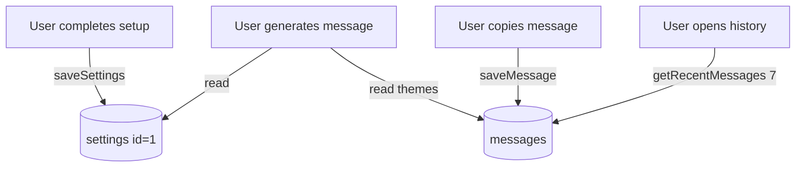

# Companion — Database

Companion uses a single local SQLite file with no ORM and no migration tooling. Schema is created automatically on first connection.

---

## File location

```
./companion.db
```

Created in the project root when the server first reads or writes data. Listed in `.gitignore` — each developer/machine has their own database.

---

## Connection

**Module:** `lib/db.ts`

```typescript
import Database from "better-sqlite3";
const DB_PATH = path.join(process.cwd(), "companion.db");
```

- One singleton connection per server process.
- Tables created via `CREATE TABLE IF NOT EXISTS` on first `getDb()` call.

---

## Schema

### `messages`

Stores messages the user has copied (saved intentionally, not every generation).

```sql
CREATE TABLE IF NOT EXISTS messages (
  id INTEGER PRIMARY KEY AUTOINCREMENT,
  sent_at TEXT NOT NULL,        -- ISO 8601 timestamp
  message_text TEXT NOT NULL,   -- full message body
  theme TEXT,                   -- e.g. "gratitude"
  tone TEXT                     -- e.g. "warm"
);
```

| Column | Type | Description |
|--------|------|-------------|
| `id` | INTEGER | Auto-increment primary key |
| `sent_at` | TEXT | UTC ISO string from `new Date().toISOString()` |
| `message_text` | TEXT | The generated message text |
| `theme` | TEXT | LLM-selected theme (nullable) |
| `tone` | TEXT | LLM-selected tone (nullable) |

**Written by:** `saveMessage()` — called from `POST /api/save` when user copies.

**Read by:**

- `getRecentMessages(limit)` — history panel (typically 7)
- `getRecentThemes(limit)` — fed into generation prompt to avoid theme repetition
- Generation pipeline — last 10 messages used for TF-IDF similarity check

---

### `settings`

Single-row table for recipient preferences. Always `id = 1`.

```sql
CREATE TABLE IF NOT EXISTS settings (
  id INTEGER PRIMARY KEY CHECK (id = 1),
  recipient_gender TEXT NOT NULL,    -- "female" or "male"
  recipient_context TEXT NOT NULL DEFAULT '',
  updated_at TEXT NOT NULL           -- ISO 8601 timestamp
);
```

| Column | Type | Description |
|--------|------|-------------|
| `id` | INTEGER | Always `1` (enforced by CHECK constraint) |
| `recipient_gender` | TEXT | `"female"` (Her) or `"male"` (Him) |
| `recipient_context` | TEXT | Free-text description of the recipient |
| `updated_at` | TEXT | Last modification timestamp |

**Written by:** `saveSettings()` — upsert via `INSERT … ON CONFLICT DO UPDATE`.

**Read by:** `getSettings()` — returns `null` if no row or invalid gender (forces GET STARTED onboarding overlay).

---

## Query reference

### `getRecentMessages(limit: number)`

```sql
SELECT id, sent_at, message_text, theme, tone
FROM messages
ORDER BY sent_at DESC
LIMIT ?
```

Returns newest first.

---

### `saveMessage(message_text, theme, tone)`

```sql
INSERT INTO messages (sent_at, message_text, theme, tone)
VALUES (?, ?, ?, ?)
```

---

### `getRecentThemes(limit: number)`

```sql
SELECT theme FROM messages
WHERE theme IS NOT NULL AND theme != ''
ORDER BY sent_at DESC
LIMIT ?
```

Returns theme strings only (not full messages). Used in `lib/context.ts` → generation prompt.

---

### `getSettings()`

```sql
SELECT recipient_gender, recipient_context, updated_at
FROM settings
WHERE id = 1
```

Returns `null` if missing or if `recipient_gender` is not `"female"` or `"male"`.

---

### `saveSettings(recipient_gender, recipient_context)`

```sql
INSERT INTO settings (id, recipient_gender, recipient_context, updated_at)
VALUES (1, ?, ?, ?)
ON CONFLICT(id) DO UPDATE SET
  recipient_gender = excluded.recipient_gender,
  recipient_context = excluded.recipient_context,
  updated_at = excluded.updated_at
```

---

## Data lifecycle



**Important:** Generating a message does **not** write to the database. Only copying does. This means "Try Again" / "Regenerate" does not pollute history.

---

## Inspecting the database

With [sqlite3 CLI](https://sqlite.org/cli.html):

```bash
sqlite3 companion.db

.tables
SELECT * FROM settings;
SELECT sent_at, theme, substr(message_text, 1, 60) FROM messages ORDER BY sent_at DESC LIMIT 7;
```

---

## Backup and reset

**Backup:** Copy `companion.db` to another location.

**Reset:** Delete `companion.db` and restart the dev server. Tables are recreated empty; user sees the setup screen again.
